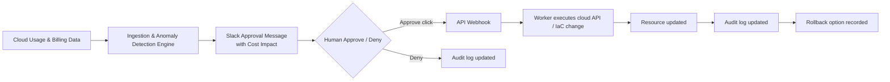

# Cindr Architecture

> **Product:** Cindr — *Catch the waste before it burns.*

## Stage 1 boundary

This stage establishes structure and plumbing only. Detection, anomaly scoring, approvals, remediation execution, rollback, and provider-side mutations are not implemented. The state vocabulary and audit-first design are documented now so later stages can extend the same contracts without architectural drift.

## Data flow

The intended control loop is: **Cloud Usage & Billing Data → Ingestion & Anomaly Detection Engine → Slack Approval Message with Cost Impact → Approve click → Webhook → Worker executes cloud API/IaC change → Resource updated → Audit log updated.** Every state transition is expected to be persisted before the next transition is attempted. Slack is a delivery and interaction surface; the audit log remains the source of truth.

## Component responsibilities

### API (`apps/api`)

The Fastify API is the synchronous control-plane boundary. It exposes health checks now and will later own authenticated dashboard endpoints, Slack webhook handling, approval state transitions, and read access to audit history. It should validate requests and record durable state before publishing work to the queue.

### Worker (`apps/worker`)

The BullMQ worker is the asynchronous execution boundary. It will later consume scan and remediation jobs, apply idempotency and retry policies, call cloud or IaC adapters, and persist the result of each transition. Stage 1 includes only a no-op processor that proves the queue process can start.

### Web (`apps/web`)

The Next.js App Router dashboard is the human-facing control plane. It will later show detected waste, cost impact, approval status, audit history, and rollback actions. Stage 1 includes a minimal “Hello, Cindr” page and establishes Tailwind/PostCSS wiring.

### Database (`packages/db`)

The database package owns the PostgreSQL schema, migration configuration, and shared persistence types. Drizzle ORM was selected for its SQL-first TypeScript schema and explicit PostgreSQL/TimescaleDB compatibility. The initial schema establishes resources and append-oriented audit events without implementing product workflows.

### Slack (`packages/slack`)

The Slack package owns the Bolt app factory and Block Kit message builders. It will later handle interactive approval callbacks and response updates. Stage 1 provides a cost-impact approval message builder while keeping credentials in environment variables.

### Cloud adapters (`packages/cloud-adapters`)

The cloud adapter package isolates provider SDKs behind the `CloudProvider` interface. AWS is the first implementation using AWS SDK v3, with operations shaped so a future GCP implementation can satisfy the same interface. Stage 1 provides thin AWS wrappers but no detection policy or remediation orchestration.

## Reliability principles carried forward

The implementation is designed around idempotent actions, reversible defaults, explicit human or policy approval, provider/API retries, and a complete audit trail. These are architecture constraints for later stages, not silent automation in the scaffold.
