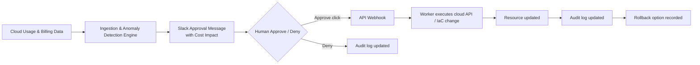

# Cindr Architecture

> **Product:** Cindr — *Catch the waste before it burns.*

## Stage 1 boundary

This stage establishes structure and plumbing only. Detection, anomaly scoring, approvals, remediation execution, rollback, and provider-side mutations are not implemented. The state vocabulary and audit-first design are documented now so later stages can extend the same contracts without architectural drift.

## Data flow



The intended control loop is: **Cloud Usage & Billing Data → Ingestion & Anomaly Detection Engine → Slack Approval Message with Cost Impact → Approve click → Webhook → Worker executes cloud API/IaC change → Resource updated → Audit log updated.** Every state transition is expected to be persisted before the next transition is attempted. Slack is a delivery and interaction surface; the audit log remains the source of truth.

## Component responsibilities

### API (`apps/api`)

The Fastify API is the synchronous control-plane boundary. It exposes health checks now and will later own authenticated dashboard endpoints, Slack webhook handling, approval state transitions, and read access to audit history. It should validate requests and record durable state before publishing work to the queue.

### Worker (`apps/worker`)

The BullMQ worker is the asynchronous execution boundary. It will later consume scan and remediation jobs, apply idempotency and retry policies, call cloud or IaC adapters, and persist the result of each transition. Stage 1 includes only a no-op processor that proves the queue process can start.

### Web (`apps/web`)

The Next.js App Router dashboard is the human-facing control plane. It will later show detected waste, cost impact, approval status, audit history, and rollback actions. Stage 1 includes a minimal “Hello, Cindr” page and establishes Tailwind/PostCSS wiring.

### Database (`packages/db`)

The database package owns the PostgreSQL schema, migration configuration, and shared persistence types. Drizzle ORM was selected for its SQL-first TypeScript schema and explicit PostgreSQL/TimescaleDB compatibility. The initial schema establishes resources and append-oriented audit events without implementing product workflows.

### Slack (`packages/slack`)

The Slack package owns the Bolt app factory and Block Kit message builders. It will later handle interactive approval callbacks and response updates. Stage 1 provides a cost-impact approval message builder while keeping credentials in environment variables.

### Cloud adapters (`packages/cloud-adapters`)

The cloud adapter package isolates provider SDKs behind the `CloudProvider` interface. AWS is the first implementation using AWS SDK v3, with operations shaped so a future GCP implementation can satisfy the same interface. Stage 1 provides thin AWS wrappers but no detection policy or remediation orchestration.

## Reliability principles carried forward

The implementation is designed around idempotent actions, reversible defaults, explicit human or policy approval, provider/API retries, and a complete audit trail. These are architecture constraints for later stages, not silent automation in the scaffold.

## Stage 2 data model and state machine

The Stage 2 relational model is implemented in `packages/db/src/schema.ts` and materialized by the SQL migration in `packages/db/migrations/0000_next_sleeper.sql`. PostgreSQL enums constrain provider, resource type, finding status, action type, action status, and audit entity type at the database boundary. The `audit_log` table has a database trigger that rejects `UPDATE` and `DELETE`, making the audit trail append-only even if an application path is bypassed.

The finding lifecycle is explicitly guarded in `packages/db/src/state-machine.ts`:

```text
detected  -> proposed | denied | expired
proposed  -> approved | denied | expired
approved  -> executing | expired
executing -> completed | failed
completed -> rolled_back
failed    -> executing | rolled_back
rolled_back, denied, expired -> terminal
```

A remediation action has its own execution lifecycle:

```text
pending   -> executing
executing -> completed | failed
completed -> rolled_back
failed    -> executing | rolled_back
rolled_back -> terminal
```

The transition functions lock the current row, validate the transition against the explicit map, update the status with an optimistic current-status predicate, and insert the matching `audit_log` row inside the same Drizzle transaction. If either the status update or audit insert fails, the transaction rolls back. Repeating a request for a resource already in the requested status is treated as an idempotent no-op; illegal status changes throw `IllegalTransitionError`.

## ERD relationships in prose

A `cloud_accounts` row represents one connected AWS or GCP account. It owns many `resources` through `resources.cloud_account_id`, and it also owns many `policies` through `policies.cloud_account_id`. The account stores only a `credentials_ref`, which points to an external secrets manager; raw credentials are not represented in this schema.

Each `resources` row belongs to exactly one cloud account and is uniquely identified within that account by its provider resource type and external ID. A resource can have many `waste_findings` through `waste_findings.resource_id`. Deleting an account cascades to its resources and policies; deleting a resource cascades to its findings and their remediation actions.

A `waste_findings` row is one detected waste instance on one resource. It stores evidence and savings as JSONB/integer columns, then advances through the guarded status enum. A finding can have many `remediation_actions` through `remediation_actions.waste_finding_id`, allowing the system to preserve distinct attempts or action plans while keeping each action idempotently keyed.

A `remediation_actions` row describes the provider-side operation associated with a finding. Its action type is constrained to stop, detach, delete, or resize operations. `is_reversible` records whether the action is safe to undo, while `rollback_action` stores the structured provider-neutral instructions required to reverse it. `idempotency_key` is unique across all actions so retried approvals cannot create duplicate executions.

`audit_log` is polymorphic rather than foreign-keyed: each row points to either a waste finding or remediation action through `entity_type` and `entity_id`. This preserves a single ordered append-only audit stream for both state machines. The application writes a row for every transition, while the database trigger prevents later mutation. `policies` are scoped to a cloud account and store user-defined JSON rules, including the future auto-approve condition; they do not bypass the state machine or audit requirements.

## Stage 2 seed data

Run `npm run migrate --workspace @cindr/db` with a reachable `DATABASE_URL`, then run `npm run seed --workspace @cindr/db`. The idempotent fixture creates one fake AWS account, three fake resources (EBS, RDS, and EC2), and two findings. One finding ends in `proposed`; the other follows the audited approval path and ends in `approved`. The fixture uses fake identifiers and a `secrets://` credentials reference only; it never stores raw cloud credentials.
